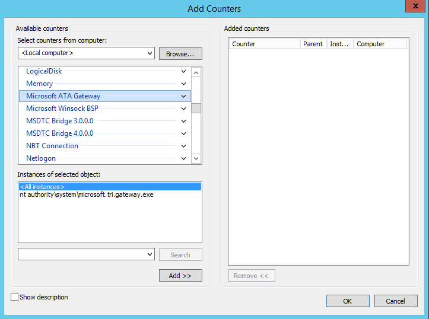
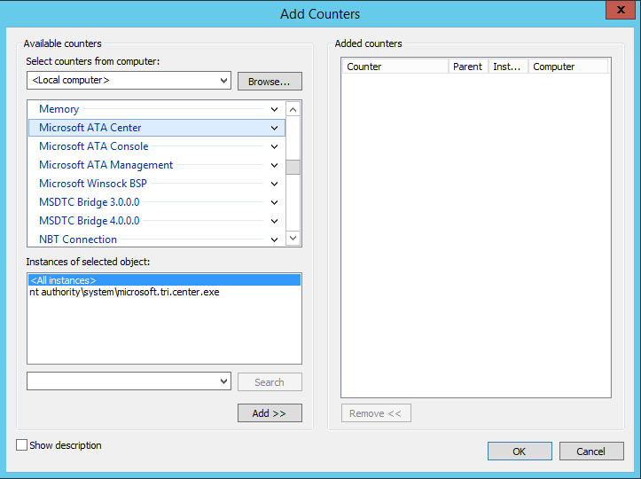

# Troubleshooting ATA using the performance counters
The ATA performance counters provide insight into how well each component of ATA is performing.

**ATA component process**:

1.  When a component reaches its maximum size, it blocks the previous component from sending more entities to it.

2.  Then, eventually the previous component will start to increase **its** own size until it blocks the component before it, from sending more entities.

3.  This happens all the way back to the initial NetworkListener component which will drop traffic when it can no longer forward entities.

    This means that the in order to remedy the chain reaction that causes dropped traffic, you have to fix the problem at the end of the chain.
    Refer to [ATA Architecture](../Topic/ATA_Architecture.md) to understand the flow of internal ATA components.

## ATA Gateway performance counters
You can observe the real time performance status of the ATA Gateway by adding the ATA Gateway's performance counters.
This is done by opening "Performance Monitor" and adding all counters for the ATA Gateway. The name of the performance counter object is: "Microsoft ATA Gateway".

Here is the list of the main ATA Gateway counters to pay attention to:

|Counter|Description|Threshold|Troubleshooting|
|-----------|---------------|-------------|-------------------|
|NetworkListener Captured Parser Messages/Sec|The amount of traffic being processed by the ATA Gateway every second.|No threshold|Helps you understand the amount of traffic that is being parsed by the ATA Gateway.|
|NetworkListener Captured Dropped Messages/Sec|The amount of traffic being dropped by the ATA Gateway every second.|This number should be zero all of the time (rare short burst of drops are acceptable).|Check if there is any component that reached its maximum size  and is blocking previous components all the way to the NetworkListener. Refer to the **ATA Component Process** above.  Check that there is no issue with the CPU or memory.|
|NetworkListener Captured Dropped ETW Real Time Buffers/Sec|The amount of traffic being dropped by the ATA Gateway every second.|This number should be zero all of the time (rare short burst of drops are acceptable).|Check if there is any component that reached its maximum size  and is blocking previous components all the way to the NetworkListener.Refer to the **ATA Component Process** above.  Check that there is no issue with the CPU or memory.|
|NetworkListener Captured Dropped ETW Log Buffers/Sec|The amount of traffic being dropped by the ATA Gateway every second.|This number should be zero all of the time (rare short burst of drops are acceptable).|Check if there is any component that reached its maximum size  and is blocking previous components all the way to the NetworkListener. Refer to the **ATA Component Process** above.  Check that there is no issue with the CPU or memory.|
|NetworkListener Captured Dropped ETW Events/Sec|The amount of traffic being dropped by the ATA Gateway every second.|This number should be zero all of the time (rare short burst of drops are acceptable).|Check if there is any component that reached its maximum size  and is blocking previous components all the way to the NetworkListener. Refer to the **ATA Component Process** above.  Check that there is no issue with the CPU or memory.|
|NetworkActivityTranslator Message Data # Block Size|The amount of traffic queued for translation to Network Activities (NAs).|Should be less than the maximum-1 (default maximum: 100,000)|Check if there is any component that reached its maximum size  and is blocking previous components all the way to the NetworkListener. Refer to the **ATA Component Process** above.  Check that there is no issue with the CPU or memory.|
|EntityResolver Activity Block Size|The amount of Network Activities (NAs) queued for resolution.|Should be less than the maximum-1 (default maximum: 10,000)|Check if there is any component that reached its maximum size  and is blocking previous components all the way to the NetworkListener. Refer to the **ATA Component Process** above.  Check that there is no issue with the CPU or memory.|
|EntitySender Entity Batch Block Size|The amount of Network Activities (NAs) queued to be sent to the ATA Center.|Should be less than the maximum-1 (default maximum: 1,000,000)|Check if there is any component that reached its maximum size  and is blocking previous components all the way to the NetworkListener. Refer to the **ATA Component Process** above.  Check that there is no issue with the CPU or memory.|
|EntitySender Batch Send Time|The amount of time it took to send the last batch.|Should be less than 1000 milliseconds most of the time|Check if there are any networking issues between the ATA Gateway and the ATA Center.|
> [!NOTE]
> -   Timed counters are in milliseconds.
> -   It is sometimes more convenient to monitor the full list of the counters by using the "Report" graph type (example: real time monitoring of all the counters)

## ATA Center performance counters
You can observer the real-time performance status of the ATA Center by adding the ATA Center's performance counters.

This is done by opening "Performance Monitor" and adding all counters for the ATA Center. The name of the performance counter object is: "Microsoft ATA Center".

Here is the list of the main ATA Center counters to pay attention to:

|Counter|Description|Threshold|Troubleshooting|
|-----------|---------------|-------------|-------------------|
|EntityReceiver Entity Batch Block Size|The number of entity batches queued by the ATA Center.|Should be less than the maximum-1 (default maximum: 100)|Check if there is any component that reached its maximum size  and is blocking previous components all the way to the NetworkListener.  Refer to the **ATA Component Process** above.  Check that there is no issue with the CPU or memory.|
|NetworkActivityProcessor Network Activity Block Size|The number of Network Activities (NAs) queued for processing.|Should be less than the maximum-1 (default maximum: 10,000)|Check if there is any component that reached its maximum size  and is blocking previous components all the way to the NetworkListener. Refer to the **ATA Component Process** above.  Check that there is no issue with the CPU or memory.|
|EntityProfiler Network Activity Block Size|The number of Network Activities (NAs) queued for profiling.|Should be less than the maximum-1 (default maximum: 10,000)|Check if there is any component that reached its maximum size  and is blocking previous components all the way to the NetworkListener. Refer to the **ATA Component Process** above.  Check that there is no issue with the CPU or memory.|
|CenterDatabaseClient &#42; Block Size|The number of Network Activities, of a specific type, queued to be written to the database.|Should be less than the maximum-1 (default maximum: 50,000)|Check if there is any component that reached its maximum size  and is blocking previous components all the way to the NetworkListener. Refer to the **ATA Component Process** above.  Check that there is no issue with the CPU or memory.|
|DetectionEngine Detection Time|The total amount of time the last full cycle of deterministic detections took.|Should be less than 900,000 (15 minutes)|Check that there is no issue with the CPU, memory or storage.|
> [!NOTE]
> -   Timed counters are in milliseconds
> -   It is sometimes more convenient to monitor the full list of the counters using the graph type for Report (example: real time monitoring of all the counters).

Here is the list of main operating system counters to pay attention to:

|Counter|Description|Threshold|Troubleshooting|
|-----------|---------------|-------------|-------------------|
|Processor(_Total)\% Processor Time|The percentage of elapsed time that the processor spends to execute a non-Idle thread.|Less than 80% on average|Check if there is a specific process that is taking a lot more processor time than it should.  Add more processors.  Reduce the amount of traffic per server.  The "Processor(_Total)\% Processor Time" counter may be less accurate on virtual servers, in which case the more accurate way to measure the lack of processor power is through the "System\Processor Queue Length" counter.|
|System\Context Switches/sec|The combined rate at which all processors are switched from one thread to another.|Less than 5000&#42;cores (physical cores)|Check if there is a specific process that is taking a lot more processor time than it should.  Add more processors.  Reduce the amount of traffic per server.  The "Processor(_Total)\% Processor Time" counter may be less accurate on virtual servers, in which case the more accurate way to measure the lack of processor power is through the "System\Processor Queue Length" counter.|
|System\Processor Queue Length|The number of threads that are ready to execute and are waiting to be scheduled.|Less than 5&#42;cores (physical cores)|Check if there is a specific process that is taking a lot more processor time than it should.  Add more processors.  Reduce the amount of traffic per server.  The "Processor(_Total)\% Processor Time" counter may be less accurate on virtual servers, in which case the more accurate way to measure the lack of processor power is through the "System\Processor Queue Length" counter.|
|Memory\Available MBytes|The amount of physical memory (RAM) available for allocation.|Should be more then 512|Check if there is a specific process that is taking a lot more physical memory than it should.  Increase the amount of physical memory.  Reduce the amount of traffic per server.|
|LogicalDisk(&#42;)\Avg. Disk sec/Read|The average latency for reading data from the disk (you should choose the database drive as the instance).|Should be less than 10 milliseconds|Check if there is a specific process that is utilizing the database drive more than it should.  Consult with your storage team/vendor if this drive can deliver the current workload while having less than 10ms of latency. The current workload can be determined by using the disk utilization counters.|
|LogicalDisk(&#42;)\Avg. Disk sec/Write|The average latency for writing data to the disk (you should choose the database drive as the instance).|Should be less than 10 milliseconds|Check if there is a specific process that is utilizing the database drive more than it should.  Consult with your storage team/vendor if this drive can deliver the current workload while having less than 10ms of latency. The current workload can be determined by using the disk utilization counters.|
|\LogicalDisk(&#42;)\Disk Reads/sec|The rate of performing read operations to the disk.|No threshold|Disk utilization counters can add insight when troubleshooting storage latency.|
|\LogicalDisk(&#42;)\Disk Read Bytes/sec|The number of bytes per second that are being read from the disk.|No threshold|Disk utilization counters can add insight when troubleshooting storage latency.|
|\LogicalDisk(&#42;)\Disk Writes/sec|The rate of performing write operations to the disk.|No threshold|Disk utilization counters (can add insights when troubleshooting the storage latency)|
|\LogicalDisk(&#42;)\Disk Write Bytes/sec|The number of bytes per second that are being written to the disk.|No threshold|Disk utilization counters can add insight when troubleshooting storage latency.|
